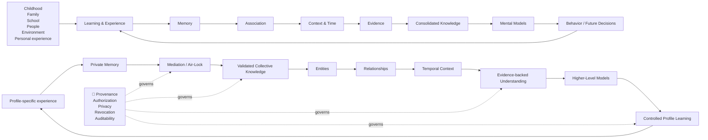
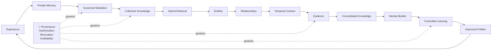

# Proposed README Section — Mnemosyne Learning Architecture

## 🧠 Mnemosyne: A Memory Architecture Inspired by Human Learning

Mnemosyne is designed around the idea that useful long-term learning is not a single memory mechanism.

A human does not simply store everything in one database and search it by similarity. Experiences are processed, remembered, associated with other knowledge, interpreted in context, consolidated over time, and eventually used to build broader understanding.

Human learning is also shaped by development. Knowledge and behavior are influenced by childhood experience, education at school, guidance and learning from family, personal development and reflection, interactions with other people, and the surrounding environment and culture. These experiences become inputs to memory, skills, expectations, relationships, and mental models that continue to evolve throughout life.

Mnemosyne follows a similar progression — **as an architectural analogy, not as a claim that it reproduces human cognition.**

The project progressively develops from protected individual memories into a governed collective knowledge system capable of understanding entities, relationships, time, evidence, and eventually higher-level models.

## Human Learning ↔ Mnemosyne

The human side shows both **where learning comes from** and **how information can develop into increasingly structured understanding**. The Mnemosyne side shows the corresponding software architecture and roadmap.

```mermaid
flowchart LR

    subgraph HUMAN["🧠 HUMAN LEARNING — Conceptual Analogy"]
        direction TB

        subgraph SOURCES["🌱 WHERE HUMANS LEARN"]
            C["Childhood Experience<br/>Early experiences & patterns"]
            F["Family<br/>Language • values • habits"]
            S["School / Education<br/>Structured knowledge • skills"]
            P["People & Peers<br/>Social learning • perspectives"]
            E["Personal Experience<br/>Practice • success • failure"]
            R["Reflection<br/>Self-understanding • metacognition"]
            ENV["Environment & Culture<br/>Context • norms • shared knowledge"]
        end

        W["Working Memory<br/>Current context"]
        EP["Episodic Memory<br/>Specific experiences"]
        SM["Semantic Memory<br/>Facts & learned knowledge"]
        AS["Associative Memory<br/>Connections & relationships"]
        T["Temporal Understanding<br/>Sequence & change"]
        CON["Memory Consolidation<br/>Repeated/evaluated experience"]
        MM["Mental Models<br/>Patterns • concepts • expectations"]

        C --> W
        F --> W
        S --> W
        P --> W
        E --> W
        R --> W
        ENV --> W

        W --> EP
        W --> SM
        EP --> AS
        SM --> AS
        AS --> T
        T --> CON
        SM --> CON
        CON --> MM
        MM --> R
    end


    subgraph MNEMOSYNE["🧩 MNEMOSYNE — Memory & Learning Architecture"]
        direction TB

        M1["PHASES 1–3<br/>FOUNDATION<br/><br/>Profile-local memory<br/>Mediation / Air-Lock<br/>Collective Knowledge Base"]

        M2["PHASES 4–7<br/>OBSERVATION & EXPLORATION<br/><br/>Athena interface<br/>Semantic embeddings<br/>Collective visualization<br/>Browser"]

        M3["PHASE 8<br/>HYBRID RETRIEVAL<br/>✓ COMPLETE<br/><br/>Semantic + BM25<br/>Graph + temporal signals<br/>RRF + optional reranking<br/>Retrieval explainability"]

        M4["PHASE 9<br/>BROWSER-FACING HYBRID RETRIEVAL<br/>✓ COMPLETE<br/><br/>Hybrid Search<br/>Filtering & controls<br/>Explainability<br/>Source inspection<br/>Browser integration"]

        M5["🚩 PHASE 10 — CURRENT<br/>ENTITY & RELATIONSHIP INTELLIGENCE<br/><br/>Canonical entities<br/>Entity resolution & aliases<br/>Co-occurrence detection<br/>Typed relationships<br/>Graph enrichment<br/>Relationship provenance"]

        M6["PHASE 11<br/>TEMPORAL INTELLIGENCE<br/><br/>Events<br/>Temporal relationships<br/>Changing facts<br/>Temporal conflicts"]

        M7["PHASE 12<br/>EVIDENCE CONSOLIDATION<br/>& MEMORY SYNTHESIS<br/><br/>Multiple memories →<br/>evidence-backed knowledge"]

        M8["PHASE 13<br/>HIGHER-LEVEL MENTAL MODELS<br/><br/>Stable concepts<br/>Inferred relationships<br/>Governed derived models"]

        M9["PHASE 14<br/>CROSS-PROFILE LEARNING<br/>& CONTROLLED TRANSFER<br/><br/>Governed knowledge sharing<br/>between Hermes profiles"]

        M10["PHASE 15<br/>ADVANCED RETRIEVAL OPTIMIZATION<br/><br/>Query classification<br/>Retrieval routing<br/>Multilingual retrieval<br/>Evaluation & optimization"]

        M11["PHASE 16<br/>DISTRIBUTED COLLECTIVE<br/>/ LAN FEDERATION<br/><br/>Controlled collective knowledge<br/>across Mnemosyne instances"]

        M12["PHASE 17<br/>GOVERNANCE, AUDIT<br/>& SECURITY HARDENING<br/><br/>Security review<br/>Adversarial testing<br/>Hardened governance"]

        M13["PHASE 18<br/>PRODUCTIONIZATION<br/>& FINAL VALIDATION<br/><br/>Deployment<br/>Operational readiness<br/>Final validation"]

        M14["🌐 FINAL VISION<br/>CONTINUOUS GOVERNED<br/>COLLECTIVE LEARNING<br/><br/>Observe → Remember → Validate<br/>→ Understand → Share → Learn"]

        M1 --> M2
        M2 --> M3
        M3 --> M4
        M4 --> M5
        M5 --> M6
        M6 --> M7
        M7 --> M8
        M8 --> M9
        M9 --> M10
        M10 --> M11
        M11 --> M12
        M12 --> M13
        M13 --> M14
        M14 -.-> M1
    end


    %% Conceptual mapping from human learning to Mnemosyne
    W -. "active context" .-> M2
    EP -. "experiences / memories" .-> M1
    SM -. "knowledge retrieval" .-> M3
    AS -. "entities & relationships" .-> M5
    T -. "time & change" .-> M6
    CON -. "evidence consolidation" .-> M7
    MM -. "higher-level understanding" .-> M8
    P -. "learning from others" .-> M9
    ENV -. "shared knowledge" .-> M11
    R -. "explainability / self-evaluation" .-> M4


    G["🔐 GOVERNANCE — APPLIES THROUGHOUT<br/><br/>
    Profile isolation • Local-first architecture • SQLite-first storage<br/>
    Mediation / Air-Lock • Privacy filtering • Explicit promotion<br/>
    Explicit adoption • Provenance • Revocation • Auditability<br/>
    No silent destructive consolidation • No automatic trust → adoption<br/>
    No raw private-memory leakage"]

    G -.-> M1
    G -.-> M14
```

## Where We Are Now

### 🟢 Phases 1–10 — COMPLETE

The foundation, profile-local memory architecture, mediation boundary, collective knowledge base, semantic representation, visualization, hybrid retrieval, Browser-facing retrieval, entity intelligence, relationship intelligence, entity resolution, relationship evidence, and governed graph enrichment have been implemented and validated through Phase 10.

### 🚩 Phase 12 — COMPLETE / PHASE 13 READY

Mnemosyne has now moved beyond:

> **“What are the things represented in those memories, and how are those things related?”**

and:

> **“When were those things observed, how did they change, and what evidence supports those observations?”**

Phase 11 — **Temporal Intelligence** — established the missing dimension of sequence, state, change, historical validity, and time-aware interpretation.

Phase 12 — **Evidence Consolidation & Memory Synthesis** — adds the governed consolidation layer required to combine related observations without destroying their evidence.

The Phase 12 implementation covers:

- **Observation similarity** — deterministic multi-signal similarity across normalized content, semantic similarity, entities, relationships, temporal compatibility, evidence, profile overlap, identifiers, observation type, confidence, and provenance.
- **Near-duplicate detection** — deterministic exact and near-duplicate classification using normalized text, token overlap, and sequence similarity.
- **Consolidation candidates** — explicit candidate modeling with supporting evidence, contradictory evidence, source profiles, temporal compatibility, confidence, provenance state, and proposed outcomes.
- **Evidence validation** — source-memory existence, profile authorization, provenance completeness, lifecycle state, temporal compatibility, revocation, and contradiction validation.
- **Evidence weighting** — deterministic evidence scoring with confidence, precision, reliability, recency, corroboration, independence, and provenance signals.
- **Contradiction handling** — explicit preservation of contradictory evidence, temporal separation, conflict, and review-required outcomes without allowing weighting to suppress contradiction.
- **Evidence-preserving synthesis** — derived synthesis that retains supporting evidence, contradictory evidence, source profiles, current versus historical evidence, provenance state, and temporal context.
- **Governance preservation** — no destructive source-memory consolidation, no provenance loss, no silent contradiction suppression, no revocation bypass, and no automatic cross-profile adoption.

Phase 12 is complete through **12H**.

Validation:

- **133 Phase 12 targeted tests passed**
- **1,158 full regression tests passed**
- **14 tests skipped**
- **0 failures**
- **4 existing FastAPI deprecation warnings**
- `git diff --check` clean

Phase 13 — **Higher-Level Mental Models** — is now the next implementation phase.

## The Mnemosyne Memory Progression

The roadmap can also be understood as a progression through increasingly sophisticated forms of memory, development, and understanding:

| Roadmap | Mnemosyne capability | Human-learning analogy |
|---|---|---|
| **Phases 1–3** | Protected profile and collective memory foundations | Forming and protecting memories from experience |
| **Phases 4–7** | Observation, embeddings, visualization and Browser | Remembering and exploring experiences |
| **Phase 8** | Hybrid retrieval | Recalling using multiple cues |
| **Phase 9** | Browser-facing retrieval and explainability | Consciously accessing and examining memories |
| **Phase 10** | Entities and relationships | Associative memory and social understanding |
| **Phase 11 ✓** | Temporal intelligence | Understanding sequence and change |
| **Phase 12 ✓** | Evidence consolidation and synthesis | Memory consolidation |
| **Phase 13 ← NOW** | Higher-level mental models | Building concepts and patterns through experience, education, and development |
| **Phase 14** | Controlled cross-profile learning | Social learning and learning from others |
| **Phase 15** | Advanced retrieval optimization | Improving recall strategies |
| **Phase 16** | Distributed collective / LAN federation | Distributed shared knowledge |
| **Phase 17** | Governance, audit and security | Evaluating trust, sources, and learned guidance |
| **Phase 18** | Productionization and final validation | Mature continuous learning |

## From Learning Sources to Understanding

A particularly important part of the analogy is that human knowledge does not originate from a single source.

A person can learn from family, teachers, school, childhood experiences, peers, work, mistakes, deliberate practice, culture, and personal reflection. Different experiences may reinforce one another, conflict with one another, or provide context for one another.

Mnemosyne is designed around a comparable principle: useful knowledge can emerge from many profile-specific experiences, but the system must preserve the distinction between **where information came from**, **what has been validated**, and **what another profile is actually permitted to learn**.

## From Memory to Understanding

The important architectural transition occurs across the middle of the roadmap.

This distinction is fundamental to Mnemosyne:

**Memory is not the same thing as knowledge.  
Knowledge is not the same thing as understanding.  
Understanding is not the same thing as permission to learn or act.**

Mnemosyne's architecture deliberately separates these stages.

## The Long-Term Learning Loop

The ultimate goal is a **closed but governed learning loop**:

**Observe → Remember → Retrieve → Relate → Understand → Validate → Share → Learn → Observe**

A profile can accumulate private experience. Relevant information can pass through the mediation boundary. Validated knowledge can become part of the collective memory. Entities, relationships, temporal context, and evidence can then transform that collection of memories into increasingly useful knowledge.

In the human-learning analogy, broader development can include lessons formed during childhood, education received at school, guidance and values learned from family, personal reflection and development, and understanding gained through interactions with other people. These influences are experiences and sources of learning, not automatically correct conclusions; they must be interpreted, evaluated, and placed in context.

Eventually, governed knowledge can be selectively transferred back to profiles that can benefit from it.

The important word is **governed**.

Collective knowledge must not silently overwrite private profile memory. Learning between profiles must preserve provenance, evidence, authorization, conflict history, and revocation. A memory being present in the collective system does not automatically mean that every profile should adopt it.

The final architecture therefore aims for **continuous learning without uncontrolled memory propagation**.

> **Mnemosyne is not simply a place where Hermes agents store memories. It is the foundation for a governed collective learning system in which individual experience can become validated shared knowledge, and shared knowledge can eventually improve individual agents.**

## Roadmap Status

**Current phase: Phase 13 — Higher-Level Mental Models**

**Completed through: Phase 12 — Evidence Consolidation & Memory Synthesis**

The roadmap intentionally moves from:

**Memory → Retrieval → Entities → Relationships → Time → Evidence → Understanding → Controlled Learning → Collective Intelligence**

Phase 12 extends Mnemosyne from understanding when states were observed and how they changed to consolidating related evidence into stronger derived knowledge while preserving the underlying observations, provenance, contradictions, temporal context, and profile boundaries.
